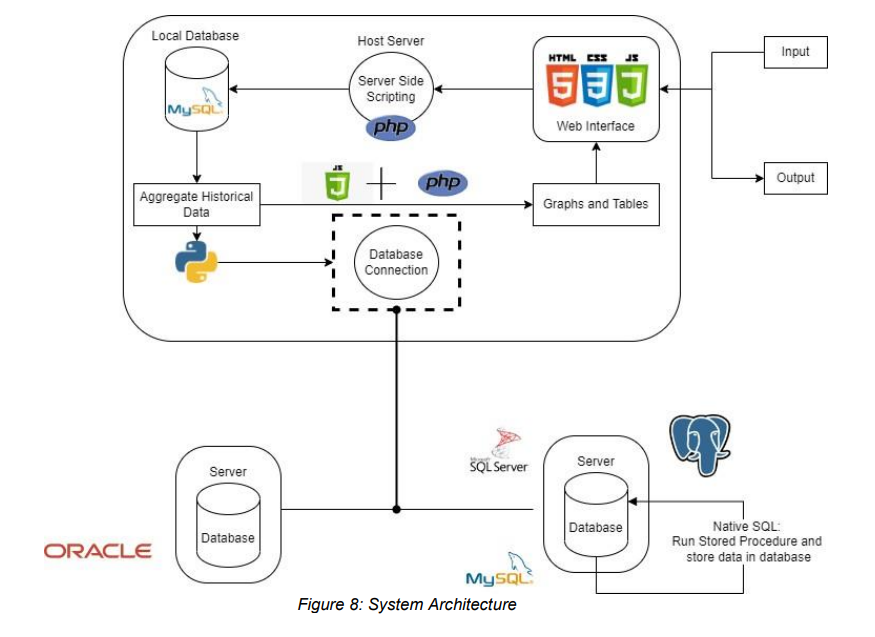
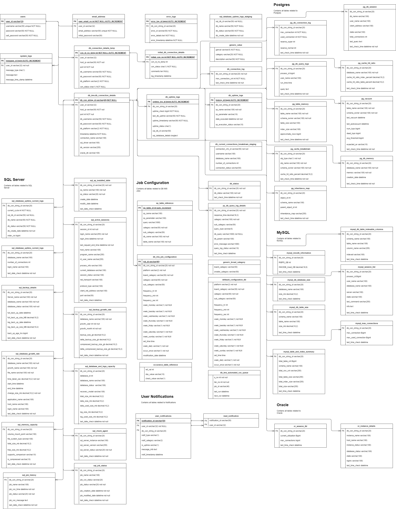

# Rey's Sample Works - Management Information System for Database Monitoring

<a href="https://reytorremis.github.io/rey_sample_works/"></a>

---
## External Links:

- [Published Documentation: Zenodo](https://zenodo.org/records/8176445)

- [Github Repository of Files](https://github.com/reytorremis/dm_ims_work_sample/tree/main)

---
## Architecture



## Database Architecture




## Files Structure

### Github Repository Details - All Important Files


```
📦db_ims
 ┣ 📂webpage
 ┃ ┣ 📂css
 ┃ ┣ 📂Webpages
 ┃ ┃ ┣ 📜add_connection_details.php
 ┃ ┃ ┣ 📜analyze_env.php
 ┃ ┃ ┣ 📜analyze_ind.php
 ┃ ┃ ┣ 📜db_connection_edit.php
 ┃ ┃ ┣ 📜home.php
 ┃ ┃ ┣ 📜idx_password_change.php
 ┃ ┃ ┣ 📜idx_product_specs.php
 ┃ ┃ ┣ 📜idx_recovery.php
 ┃ ┃ ┣ 📜idx_registration.php
 ┃ ┃ ┣ 📜index.php
 ┃ ┃ ┣ 📜inventory.php
 ┃ ┃ ┣ 📜logs.php
 ┃ ┃ ┣ 📜monitor.php
 ┃ ┃ ┗ 📜profile.php
 ┃ ┣ 📂Images
 ┃ ┣ 📂Javascripts
 ┃ ┃ ┗ 📜edit_table.js
 ┃ ┗ 📂PHP applications
 ┃ ┃ ┣ 📜auto_config_connect.php
 ┃ ┃ ┣ 📜auto_user_action.php
 ┃ ┃ ┣ 📜dbConnection.php
 ┃ ┃ ┣ 📜extract_data.php
 ┃ ┃ ┗ 📜pyfile.php
 ┣ 📂python_scripts
 ┃ ┃ ┣ 📜python_db_connection.php
 ┃ ┃ ┣ 📜run_manual.php
 ┃ ┃ ┣ 📜run_script.php
 ┃ ┃ ┣ 📜sql_server_extract_data.php
 ┃ ┃ ┣ 📜automated_run.php
 ┃ ┃ ┣ 📜local_db_connection.php
 ┃ ┃ ┣ 📜log_info.php
 ┃ ┃ ┣ 📜mailer.php
 ┃ ┃ ┣ 📜mysql_connector_class.php
 ┃ ┃ ┣ 📜mysql_extract_data.php
 ┃ ┃ ┣ 📜oracle_extract_data.php
 ┃ ┃ ┣ 📜pg_extract_data.php
 ┃ ┃ ┣ 📜py_open_sql_scripts.php
 ┃ ┃ ┣ 📜pydbc_initial_con.php
 ┃ ┃ ┗ 📜python_connector_class.php
 ┣ 📂sql_scripts
 ┃ ┃ ┣ 📂local database
 ┃ ┃ ┃ ┣ 📜all triggers.txt
 ┃ ┃ ┃ ┣ 📜all_stored_procedure_&_function.txt
 ┃ ┃ ┃ ┣ 📜all_tables.txt
 ┃ ┃ ┃ ┣ 📜all_view_tables.txt
 ┃ ┃ ┗ 📂sql_scripts_target_db
 ┃ ┃ ┃ ┣ 📂my-sql
 ┃ ┃ ┃ ┃ ┗ 📜install-mysql-sp.sql
 ┃ ┃ ┃ ┣ 📂postgres
 ┃ ┃ ┃ ┃ ┗ 📜install-db-procedure.sql
 ┃ ┃ ┃ ┣ 📂sql-server
 ┃ ┃ ┃ ┃ ┣ 📜install-sp-dbims-check-installed-sp.sql
 ┃ ┃ ┃ ┃ ┣ 📜install-sp-dbims-extract-backup-info.sql
 ┃ ┃ ┃ ┃ ┣ 📜install-sp-dbims-extract-log-and-data-info.sql
 ┃ ┃ ┃ ┃ ┣ 📜install-sp-dbims-extract-memory-capacity.sql
 ┃ ┃ ┃ ┃ ┣ 📜install-sp-display-connection-details.sql
 ┃ ┃ ┃ ┃ ┗ 📜install-sp-extract-growth-rate.sql
 ┗ 📂lib
```

### Brief Description of Files

1. Webpages
    > Contains all webpages for project
    
    + add_connection_details.php &rarr; _Connection Details Page_
    + analyze_env.php &rarr; _Monitor health across multiple database with in-depth details for analysis_
    + analyze_ind.php &rarr; _Monitor a single database instance with in-depth details for analysis_
    + db_connection_edit.php &rarr; _Edit Connection Details of Database Instance_
    + idx_password_change.php &rarr; _Change Password Form_
    + idx_recovery.php &rarr; _Password Recovery Form_
    + idx_registration.php &rarr; _Email and Password Registration_
    + index.php &rarr; _Landing Page_
    + inventory.php &rarr; _Displays all connected database instances_
    + logs.php &rarr; _Provides logs of database and webpage connection_
    + monitor.php &rarr; _Provides in-depth health and activity status of database instance_
    + profile.php &rarr; _User Details_

2. Javascript
    + edit_table.js &rarr; _Javascript reference by connection details for dynamic editting without the need for submission form_

3. PHP applications
   > Backend scripts for communicating with Python, AWS-hosted MySQL Database and Front-end webpage

   + auto_config_connect.php &rarr; _Test connection with RDBMS target and logs it if successful_
   + auto_user_action.php &rarr; _Checks Username and Password then verifies if username + password exists in database_
   + dbConnection.php &rarr; _AWS-hosted MySQL database credentials_
   + extract_data.php &rarr; _Get database health and status data from AWS-hosted MySQL Database_
   + extract_data.php &rarr; _Set Variables for Directories for Python, API Mailer, database connector and manual execution_

5. python_scripts
   > Backend scripts to communicate between target database and AWS-hosted MySQL database
   >> Target Database

   + python_connector_class.py &rarr; _Python Class for Target Database Connection_
   + python_db_connection.py &rarr; _Interfaces with php to run connection details on target database_
   + pydbc_initial_con.py &rarr; _Function for Checking database connection with target database_
   + py_open_sql_scripts.py &rarr; _Installs Stored Procedures in MySQL, PostgresSQL or MS SQL Server Database_
   + oracle_extract_data.py &rarr; _Extracts Data from Oracle Database_
   + pg_extract_data.py &rarr; _Extracts Data from PostgresSQL Database_
   + mysql_extract_data.py &rarr; _Extracts Data from MySQL Database_
   + sql_server_extract_data.py &rarr; _Extracts Data from MS SQL Server Database_

   >> AWS-hosted MySQL Database
   
   + mysql_connector_class.py &rarr; _MySQL Connector Class for AWS-hosted database_
   + local_db_connection.py &rarr; _Connects and interfaces with AWS-hosted MySQL Database Server_

   > Other Scripts
   
   + run_manual.py &rarr; _Executes command manually_
   + automated_run.py &rarr; _Executes command automatically by server_
   + log_info.py &rarr; _Logs all information in a text file per day_
   + mailer.py &rarr; _Connects with Mailgun API_
   + run_script.py &rarr; _Gets automated jobs and defines functions for running automatically or manually _

7. sql_scripts
    > Database Structure and SQL Scripts of Stored Procedures for target database 
    >> AWS-hosted MySQL Database
    
    + all triggers.txt &rarr; _Contains all Triggers for MySQL RDBMS_
    + all_stored_procedure_&_function.txt &rarr; _Contains all Stored Procedure & Functions for MySQL RDBMS_
    + all_tables.txt &rarr; _Contains all tables for MySQL RDBMS_
    + all_view_tables.txt &rarr; _Contains all views for MySQL RDBMS_

   >> my-sql

   + All stored Procedure installed for MySQL Target Database

   >> postgres

   + All stored Procedure installed for PostgresSQL Target Database

   >>  sql-server

   + All stored Procedure installed for MS SQL Server Target Database
