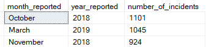
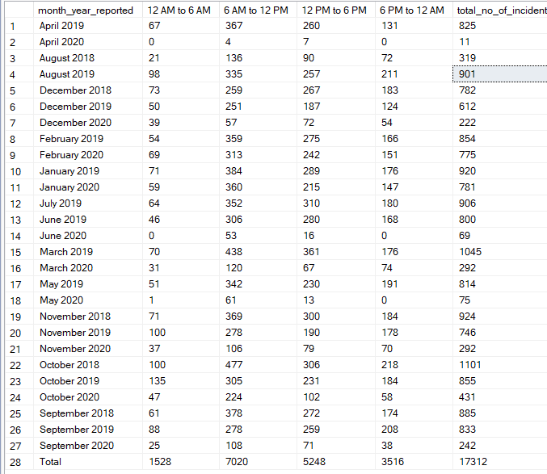
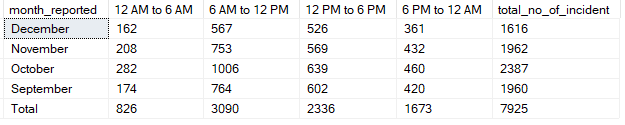

# Rey's Sample Works - MMDA Visualization

<a href="https://reytorremis.github.io/reytorrecampogrepo.github.io/"></a>
---
## Links:
[Tableau - MMDA Dashboard Visualization](https://public.tableau.com/app/profile/rey.lawrence.torrecampo/viz/MMDADashboard-Sample/Dashboard1)

---

## Visualization Sample

<div class='tableauPlaceholder' id='viz1711199652680' style='position: relative'><noscript><a href='#'></a></noscript><object class='tableauViz' style='display:none;'>
        <param name='host_url' value='https%3A%2F%2Fpublic.tableau.com%2F' />
        <param name='embed_code_version' value='3' />
        <param name='site_root' value='' />
        <param name='name' value='MMDADashboard-Sample&#47;Dashboard1' />
        <param name='tabs' value='no' />
        <param name='toolbar' value='yes' />
        <param name='static_image'
            value='https:&#47;&#47;public.tableau.com&#47;static&#47;images&#47;MM&#47;MMDADashboard-Sample&#47;Dashboard1&#47;1.png' />
        <param name='animate_transition' value='yes' />
        <param name='display_static_image' value='yes' />
        <param name='display_spinner' value='yes' />
        <param name='display_overlay' value='yes' />
        <param name='display_count' value='yes' />
        <param name='language' value='en-US' />
    </object></div>
<script type='text/javascript'>
    var divElement = document.getElementById('viz1711199652680');
    var vizElement = divElement.getElementsByTagName('object')[0];
    if (divElement.offsetWidth > 800) {
        vizElement.style.width = '1000px';
        vizElement.style.height = '827px';
    } else if (divElement.offsetWidth > 500) { vizElement.style.width = '1000px'; vizElement.style.height = '827px'; } else { vizElement.style.width = '100%'; vizElement.style.height = '927px'; } var scriptElement = document.createElement('script');
    scriptElement.src = 'https://public.tableau.com/javascripts/api/viz_v1.js'; vizElement.parentNode.insertBefore(scriptElement, vizElement);                
</script>

---
## SQL Codes
Cleaning the visualization, I used SQL in my local machine and extracted the table in excel format. Done MS SQL Server 2019.

### Defining Functions
```
    create function fx_clean_time (@time varchar(100))
    returns time as
    begin
        declare @time_output time
        select @time_output = case 
            when @time is NULL then cast('00:00 AM' as time)
            when try_cast(@time as time) is NULL then CONCAT(
                case 
                when CHARINDEX(' ',@time) > 0 then LEFT(@time, CHARINDEX(' ',@time)-1)
                else SUBSTRING(@time, 1, 4) end, 
                ' ', 
                case 
                when CHARINDEX(' ',@time) > 0 then 
                        case 
                            when SUBSTRING(@time, CHARINDEX(' ',@time)+1, 2) in ('PM', 'AM') then  SUBSTRING(@time, CHARINDEX(' ',@time)+1, 2)
                            else 'AM' end
                else 'AM'  end)
            else @time end

                return cast(@time_output as time)
    end
```

### Creating a View

View for Referencing data to its appropriate name

```
    create view vw_city_cleaning_data as
    select x.city,
        case 
        when x.city ='Parañaque' then 'Parañaque City'
        when x.city = 'Parañaque' then 'Parañaque City'
        when x.city = 'Mandaluyong' then 'Mandaluyong'
        when x.city = 'Manila' then 'Manila City'
        when x.city = 'Malabon' then 'Malabon City'
        when x.city = 'Navotas' then 'Navotas City'
        when x.city = 'Marikina' then 'Marikina City'
        when x.city = 'Kalookan City' then 'Caloocan City'
        when x.city = 'Valenzuela' then 'Valenzuela City'
        when x.city = 'San Juan' then 'San Juan City'
        when x.city = 'Taguig' then 'Taguig City'
        else x.city
        end as city_equivalent
    from (select distinct city from dbo.mmda_traffic_spatial where city is not null) x
```

View for loading data to visualization

```
    create view vw_mmda_traffic_spatial_clean as
    select
        datename(MONTH,try_convert(date, [Date], 101)) as month_reported,
        datename(YEAR, try_convert(date, [Date], 101)) as year_reported,
        [Time],
        dbo.fx_clean_time([Time]) as time_reported,
        upper(coalesce(ccd.city_equivalent, 'UNKNOWN')) as City,
        upper([Location]) as [Location],
        round([Latitude],2) as [Latitude],
        round([Longitude], 2) as [Longitude],
        try_cast([High_Accuracy] as bit) as [High_Accuracy],
        coalesce([Direction], 'UNKNOWN') as [Direction],
        coalesce([Type], 'UNKNOWN') as [Type],
        coalesce(Lanes_Blocked, 0) as Lanes_Blocked,
        upper(coalesce(Involved, 'UNKNOWN')) as Involved,
        cast(Tweet as text) as Tweet,
        cast([Source] as text) as [Source]
    from dbo.mmda_traffic_spatial mts
    left join dbo.vw_city_cleaning_data ccd
    on mts.City = ccd.city
```
## Analyzing Data

### Determining which Months has the most incidents

Using an SQL query, we can determine which months have the highest number of incidents.

```
select
	top 3
	month_reported,
	year_reported,
	count(1) as number_of_incidents
from  dbo.vw_mmda_traffic_spatial_clean
group by year_reported,month_reported
order by number_of_incidents desc
```



### Determining which Months has the most incidents


```
select
	pivot_table.City,
	coalesce([2018], 0) as [2018], 
    coalesce([2019], 0) as [2019], 
    coalesce([2020], 0) as [2020],
	x.total_number_of_incidents
from (      
        select
                City,
                year_reported,
                count(1) as number_of_incidents
        from  dbo.vw_mmda_traffic_spatial_clean
        group by year_reported, City ) t 
PIVOT(
        SUM(number_of_incidents) 
        FOR year_reported IN ([2018],[2019], [2020])
    ) pivot_table
left join (
            select
            City,
            count(1) as total_number_of_incidents
            from  dbo.vw_mmda_traffic_spatial_clean
            group by City ) x 
on pivot_table.City = x.City
order by total_number_of_incidents desc
```


### Window Time Analysis of Incidents Happening Month and Year

```
with reported_incident_per_time_window (month_year_reported, time_window, no_of_incident) as (
select
	month_reported + ' ' + year_reported,
	time_window,
	count(1)
	from (
		select year_reported,
				month_reported,
				time_reported,
				City,
				[Time],
				case 
				when time_reported <= '06:00:00' then '12 AM to 6 AM'
				when time_reported between '06:00:00' and '12:00:00' then '6 AM to 12 PM'
				when time_reported between '12:00:00' and '18:00:00' then '12 PM to 6 PM'
				when time_reported >= '18:00:00' then '6 PM to 12 AM'
				end as time_window
		from dbo.vw_mmda_traffic_spatial_clean
	) x group by year_reported, month_reported, time_window
)

select * from (
select
	month_year_reported,
	coalesce(SUM(case when time_window = '12 AM to 6 AM' then no_of_incident else NULL end),0) [12 AM to 6 AM],
	coalesce(SUM(case when time_window = '6 AM to 12 PM' then no_of_incident else NULL end),0) [6 AM to 12 PM],
	coalesce(SUM(case when time_window = '12 PM to 6 PM' then no_of_incident else NULL end),0) [12 PM to 6 PM],
	coalesce(SUM(case when time_window = '6 PM to 12 AM' then no_of_incident else NULL end),0) [6 PM to 12 AM],
	coalesce(SUM(no_of_incident),0) as total_no_of_incident
from reported_incident_per_time_window
group by month_year_reported

union

select 'Total', 
coalesce(SUM(case when time_window = '12 AM to 6 AM' then no_of_incident else NULL end),0) [12 AM to 6 AM],
coalesce(SUM(case when time_window = '6 AM to 12 PM' then no_of_incident else NULL end),0) [6 AM to 12 PM],
coalesce(SUM(case when time_window = '12 PM to 6 PM' then no_of_incident else NULL end),0) [12 PM to 6 PM],
coalesce(SUM(case when time_window = '6 PM to 12 AM' then no_of_incident else NULL end),0) [6 PM to 12 AM],
coalesce(SUM(no_of_incident),0) as total_no_of_incident
from reported_incident_per_time_window) x 
```



### Window Time Analysis of Incidents Happening Month Reported

```
with reported_incident_per_time_window (month_reported, time_window, no_of_incident) as (
select
	month_reported,
	time_window,
	count(1)
	from (
		select month_reported,
				time_reported,
				City,
				[Time],
				case 
				when time_reported <= '06:00:00' then '12 AM to 6 AM'
				when time_reported between '06:00:00' and '12:00:00' then '6 AM to 12 PM'
				when time_reported between '12:00:00' and '18:00:00' then '12 PM to 6 PM'
				when time_reported >= '18:00:00' then '6 PM to 12 AM'
				end as time_window
		from dbo.vw_mmda_traffic_spatial_clean
	) x group by month_reported, time_window
)

select * from (
select
	month_reported,
	coalesce(SUM(case when time_window = '12 AM to 6 AM' then no_of_incident else NULL end),0) [12 AM to 6 AM],
	coalesce(SUM(case when time_window = '6 AM to 12 PM' then no_of_incident else NULL end),0) [6 AM to 12 PM],
	coalesce(SUM(case when time_window = '12 PM to 6 PM' then no_of_incident else NULL end),0) [12 PM to 6 PM],
	coalesce(SUM(case when time_window = '6 PM to 12 AM' then no_of_incident else NULL end),0) [6 PM to 12 AM],
	coalesce(SUM(no_of_incident),0) as total_no_of_incident
from reported_incident_per_time_window
where month_reported like '%ber'
group by month_reported

union

select 'Total', 
coalesce(SUM(case when time_window = '12 AM to 6 AM' then no_of_incident else NULL end),0) [12 AM to 6 AM],
coalesce(SUM(case when time_window = '6 AM to 12 PM' then no_of_incident else NULL end),0) [6 AM to 12 PM],
coalesce(SUM(case when time_window = '12 PM to 6 PM' then no_of_incident else NULL end),0) [12 PM to 6 PM],
coalesce(SUM(case when time_window = '6 PM to 12 AM' then no_of_incident else NULL end),0) [6 PM to 12 AM],
coalesce(SUM(no_of_incident),0) as total_no_of_incident
from reported_incident_per_time_window
where month_reported like '%ber'
) x 

```


---
