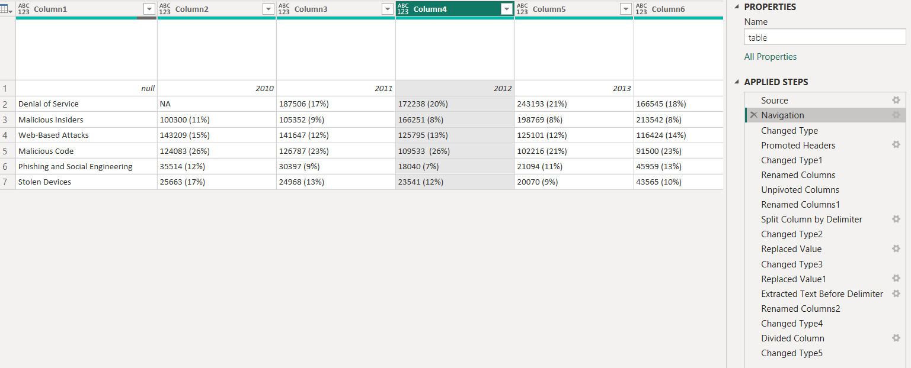
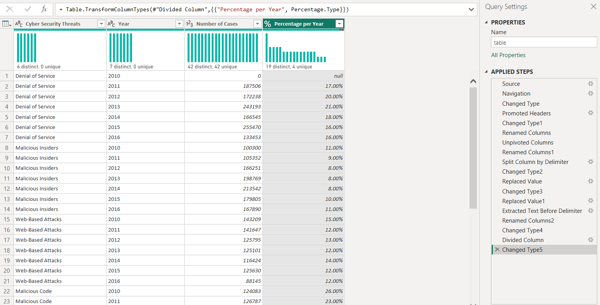
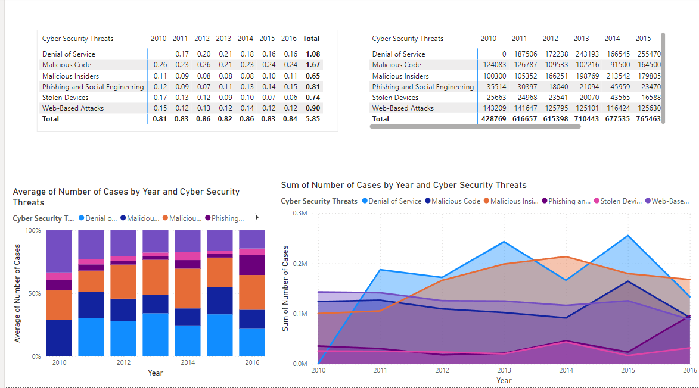

# Rey's Sample Works - Power BI Projects

## Description
This sectiion invovles Power BI data processing and visualization.

### [Cyber Security Threats Power BI Processing](cyber_security_data_set.pbix)
+ PowerBI File can be accessed through the link provided
+ Excel File for this task: 
+ Step-by-step process of Data Processing:

1. Access [Data Set](cyber_security_riks.xlsx) and load it to Power BI 
2. Promote First column to colum headers
3. Rename First Column to "Cyber Security Threats"
4. Unpivot Columns
5. Rename "Attributes" to "Year"
6. Split "Value" column by delimiter (delimiter is '(')
7. Change data type of "Year" to Whole Number
8. Replace 'NA' in "Value.1" column to 0.
9. Change data type of "Value.1" to Whole Number
10. Replace ')' in "Value.2" column to blank thereby removing it from the string.
11. Extract text before delimiter % in "Value.2" column
12. Rename "Value.1" to "Number of Cases" and "Value.2" to "Percentage per Year"
13. Change data type of "Percentage per Year" to Whole Number
14. Divide column "Percentage per Year" by 100
15. Change data type of "Percentage per Year" to Percentage
16. Visualize the data

#### Initial

#### Final

#### Visualization

### [Covid Dashboard](covid_data_set.pbix)
+ Visualize data from data set: [covid_data_set.csv](https://drive.google.com/file/d/1CyCHy0bGeTuSATpZNZVOsI3nB2YFQmtS/view?usp=drive_link)

#### Visualization

!Covid Data Set](covid_data_set.png)
